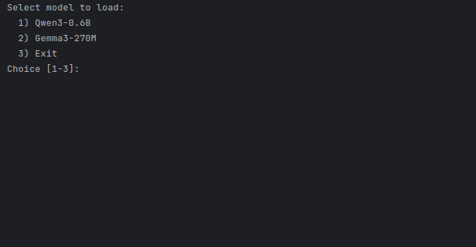

[](http://www.apache.org/licenses/LICENSE-2.0)
[](https://bell-sw.com/pages/downloads/)
[](https://maven.apache.org/)
[](http://search.maven.org/#artifactdetails|com.igormaznitsa|nano-vllm-java|1.3.0|jar)   
[](https://www.arthursacresanimalsanctuary.org/donate)

# Nano-vLLM Java

Pure **Java 21+** LLM inference library: continuous batching, paged KV cache, and Hugging Face–compatible weight
loading on **CPU only** — no CUDA, PyTorch, or native runtime bindings. Add it to a Maven or Gradle app and call it
from ordinary Java.

The latest release is **1.3.0** on Maven Central (Whisper speech-to-text, Piper text-to-speech, typed
`generate(LlmInput, LlmModality)` for embeddings / STT / TTS / raw completion, XLM-RoBERTa embeddings).
Features marked **since 1.1.0**, **since 1.2.0**, and **since 1.3.0** are in that release.

Ideas in this project were inspired by the Python [nano-vllm](https://github.com/GeeeekExplorer/nano-vllm) educational
engine.

For a guided tour of the design (scheduler, attention, tensors, RAG), see [`description.md`](description.md).

Session recording (Gemma3 load + RAG questions about the Grimm brothers and their father) — full interactive demo:
[`Example`](#interactive-chat-example):



## Supported formats and variants

One entry point: `LlmModelFactory.make(…)` (folder, `.gguf` file, or `ModelFileSource` / classpath). What you may load
depends on the **container** and the **architecture** — this is a curated subset, not every hub file.

### Weight containers

| Format | Since | What you point at | Role |
|--------|-------|-------------------|------|
| **Safetensors** | **1.0.0** | HF folder: `config.json` + tokenizer + `*.safetensors` | Dense float weights (`F32` / `F16` / `BF16` / `F64` → float32). **Since 1.1.0:** Gemma 4 text **QAT** stays packed (int2/4/8). **Since 1.3.0:** Whisper speech. If both safetensors and ONNX are present, **safetensors wins**. |
| **GGUF** | **1.0.0** | Single `.gguf` file | Packed GGML blocks; dequant on matmul / embed. Mmap ≤ ~2 GiB. Architectures: **`qwen3`** / **`lfm2`** (chat) and **`bert`** (embeddings **since 1.1.0**). |
| **ONNX** (Tier A) | **1.1.0** | HF folder: same sidecars + `model.onnx` / `model_fp16.onnx` (root or `onnx/`); Piper: `*.onnx` + `*.onnx.json` (**since 1.3.0**) | **Initializers only** — no ONNX Runtime, no graph execution. Preferred float exports; community `*_q4*` / `*_int8*` / `*_quantized*` / `with_past` names are skipped. |

Stream / classpath loads (`ModelFileSource`, `fromClasspath*`) are **since 1.1.0** (bytes → heap, no disk cache). ONNX
`external_data` sidecars need `make(Path)`; stream loads reject them.

### Architectures and APIs

| Kind | Since | Typical crate | Public use |
|------|-------|---------------|------------|
| **Qwen3** / **Gemma3** causal chat | **1.0.0** | HF safetensors (also ONNX **1.1.0**; Qwen3 GGUF **1.1.0**) | `LLM.builder(model)` → chat / generate |
| **Gemma 4 text** (QAT mobile) | **1.1.0** | HF safetensors only (packed int2/4/8; **not** GGUF / ONNX) | Same `LLM` path; vision/audio towers in the crate are skipped |
| **LFM2** hybrid causal chat | **1.0.0** | GGUF only (`lfm2`) | Same `LLM` path; not from HF safetensors / ONNX |
| **Llama** causal (incl. Tiny-LLM / SmolLM2 Instruct demos) | **1.1.0** | HF safetensors or ONNX | Same `LLM` path |
| **BERT** sentence embeddings | **1.1.0** | GGUF `bert` (e.g. gte-small); ONNX `bert` / `roberta` / `xlm-roberta` | `LLM.builder` → `generate(LlmInText, EMBEDDING)` (`LlmModel.generate` is a sequential shortcut) |
| **Whisper** speech-to-text | **1.3.0** | HF safetensors only (`openai/whisper-*`; not GGUF / ONNX / CTranslate2) | `LLM.builder` → `generate(LlmInSound, TEXT)` |
| **Piper** text-to-speech | **1.3.0** | Voice folder: `*.onnx` + `*.onnx.json` (+ optional `espeak-ng-data`) | `LLM.builder` → `generate(LlmInText, AUDIO)` → `LlmOutSoundData` |

### GGUF / ONNX dtype notes

| Path | Supported | Explicitly out |
|------|-----------|----------------|
| GGUF GGML | Current llama.cpp weight dtypes (floats, K-quants, IQ, TQ, MXFP4/NVFP4, `Q*_0`/`Q*_1`) | Removed ggml types (`Q4_2`/`Q4_3`, SIMD-repack `*_4_4`); Gemma/Llama GGUF **architectures** (Qwen2 / MoE / VL too) |
| ONNX TensorProto | FLOAT / FLOAT16 / BFLOAT16 / DOUBLE → float32 | Float8 / nibble / unknown weight types (fail loud); int/bool/string/complex initializers skipped as graph constants |

Details and honest limits: [`description.md`](description.md) chapters **7** / **7a** / **7b** / **7c** / **7d** / **7e**. Download scripts and
folder layout: [Download and load models](#download-and-load-models).

<a id="hello-world--gemma3-log-triage-in-your-app"></a>
## Hello World — Gemma3 log triage in your app

This is the usual path for library users: declare the dependency, point at a **local Gemma3** folder (any path you
choose), ask a short business question, print the answer.

### 1. Add the dependency

**Maven**

```xml
<dependency>
  <groupId>com.igormaznitsa</groupId>
  <artifactId>nano-vllm-java</artifactId>
  <version>1.3.0</version>
</dependency>
```

**Gradle (Groovy)**

```gradle
implementation 'com.igormaznitsa:nano-vllm-java:1.3.0'
```

JPMS module name: `com.igormaznitsa.nanollvm` (`requires com.igormaznitsa.nanollvm;`).
Runtime: **JDK 21+**, enough heap for the checkpoint (Gemma3-270M is typically fine with a few GB).

Download a Gemma3 instruct snapshot once (HF license + token), for example into `/opt/models/Gemma3-270M` — see
[Download scripts](#download-scripts) or Hugging Face
[google/gemma-3-270m-it](https://huggingface.co/google/gemma-3-270m-it).

### 2. Load Gemma3 from your path and triage a log snippet

```java
import com.igormaznitsa.nanollvm.llm.LLM;
import com.igormaznitsa.nanollvm.models.LlmModel;
import com.igormaznitsa.nanollvm.models.LlmModelFactory;

import java.nio.file.Path;

public final class LogTriageHelloWorld {

  public static void main(String[] args) {
    // Custom install location — not tied to this repo's ./models layout
    Path gemmaDir = Path.of("/opt/models/Gemma3-270M");

    String logExcerpt = """
        2026-08-07 22:14:01 WARN  payment-api - retry 1/3 for order=99102 cause=SocketTimeoutException
        2026-08-07 22:14:04 WARN  payment-api - retry 2/3 for order=99102 cause=SocketTimeoutException
        2026-08-07 22:14:08 ERROR payment-api - give up order=99102 after 3 timeouts upstream=billing-svc:8443
        2026-08-07 22:14:08 INFO  payment-api - marked order=99102 status=PAYMENT_FAILED
        """;

    String prompt = """
        You are helping an on-call engineer. Read the log lines and reply in three short bullets:
        1) what failed
        2) likely cause
        3) one concrete next check
        Do not invent hosts or error codes that are not in the log.

        Log:
        %s
        """.formatted(logExcerpt);

    try (LlmModel model = LlmModelFactory.make(gemmaDir);
         LLM llm = LLM.builder(model)
        .noSystemPrompt()          // Gemma chat path: keep the system role empty
        .maxModelLen(2048)
        .build()) {

      String advice = llm.chat(128).send(prompt).answer();
      System.out.println(advice);
    }
  }
}
```

What this shows: **pure Java** in / out, **your** model directory, one `LlmModelFactory.make` + `LLM.builder` +
`chat(…).send(…).answer()` — no Python sidecar. Swap the path for another Gemma3 layout, Gemma 4 text QAT, Llama, or
Qwen3 the same way (with `.systemPrompt(…)` if you want a fixed role).

In this repository the same program lives in the `nano-vllm-java-samples` module as
`com.igormaznitsa.nanollvm.samples.LogTriageHelloWorld` (defaults to `models/Gemma3-270M` via
`samples.utils.BundledModels`; optional first arg overrides the path). The sample also prints
`[timing]` lines for model load, engine build, chat turn, and total wall time:

```bash
mvn -pl nano-vllm-java-samples -q exec:java \
  -Dexec.mainClass=com.igormaznitsa.nanollvm.samples.LogTriageHelloWorld
# or: … -Dexec.args=/opt/models/Gemma3-270M
```

For the smallest in-repo smoke test (say hello, print the reply):

```bash
mvn -pl nano-vllm-java-samples -q exec:java \
  -Dexec.mainClass=com.igormaznitsa.nanollvm.samples.HelloWorld
```

Raw next-token continuation (encode a seed, print the next few token ids and the continued text;
defaults to Tiny-LLM-ONNX — download with `./models/download-tiny-llm-onnx.sh`):

```bash
mvn -pl nano-vllm-java-samples -q exec:java \
  -Dexec.mainClass=com.igormaznitsa.nanollvm.samples.NextTokenHelloWorld
# optional: … -Dexec.args="models/Tiny-LLM-ONNX Once upon a time"
```

Sentence embeddings (encode text to an L2-normalized vector; defaults to multilingual-e5-small ONNX —
download with `./models/download-multilingual-e5-small.sh`):

```bash
mvn -pl nano-vllm-java-samples -q exec:java \
  -Dexec.mainClass=com.igormaznitsa.nanollvm.samples.EmbeddingsHelloWorld
# optional: … -Dexec.args="models/multilingual-e5-small hello world"
```

Speech-to-text and text-to-speech snippets (PCM arrays, WAV, and the in-repo samples) are in
[Hello World — Whisper](#hello-world--whisper-speech-to-text) and
[Hello World — Piper](#hello-world--piper-text-to-speech).

Custom advisor **Alex** plus lexical **BM25** RAG over `rag/` (Grimm names and father; Gemma3-270M):

```bash
mvn -pl nano-vllm-java-samples -q exec:java \
  -Dexec.mainClass=com.igormaznitsa.nanollvm.samples.AdvisorRagHelloWorld
```

Load-time **RagTuner** over a bundled EPUB (Karel Čapek, *R.U.R.*): filter `.epub`, extract plain
text with JDK zip + StAX, index with BM25, then ask the play (Qwen3-0.6B chat):

```bash
mvn -pl nano-vllm-java-samples -q exec:java \
  -Dexec.mainClass=com.igormaznitsa.nanollvm.samples.RagTunerHelloWorld
# optional: … -Dexec.args="models/Qwen3-0.6B"
```

More API samples (streaming, RAG, GGUF, advisors) are in [Library quick start](#library-quick-start).

<a id="hello-world--whisper-speech-to-text"></a>
## Hello World — Whisper speech-to-text

Audio → text. `pcm` is mono `float[]` in `[-1, 1]`; WAV is uncompressed (PCM or IEEE float).
Optional `Locale` on `ofPcm` / `ofWav` is a language hint (`null` / `ROOT` = auto).
No MP3, VAD, or timestamps. Download: `./models/download-whisper-base.sh`.

```java
try (LlmModel model = LlmModelFactory.make(Path.of("models/whisper-base"));
     LLM llm = LLM.builder(model).build()) {
  LlmOutText fromPcm = (LlmOutText) llm.generate(
      LlmInSound.ofPcm(pcm, 16_000), LlmModality.TEXT);
  LlmOutText fromWav = (LlmOutText) llm.generate(
      LlmInSound.ofWav(Files.readAllBytes(Path.of("clip.wav"))), LlmModality.TEXT);
}
```

Sample: [`TranscribeHelloWorld.java`](nano-vllm-java-samples/src/main/java/com/igormaznitsa/nanollvm/samples/TranscribeHelloWorld.java)
(`piper-hello.wav` from Synthesize if present, else an `ofPcm` tone, or a WAV path).

```bash
mvn -pl nano-vllm-java-samples -q exec:java \
  -Dexec.mainClass=com.igormaznitsa.nanollvm.samples.TranscribeHelloWorld
# optional: … -Dexec.args="models/whisper-base clip.wav"
```

<a id="hello-world--piper-text-to-speech"></a>
## Hello World — Piper text-to-speech

Text → audio. `LlmOutSoundData` is PCM16 LE mono WAV plus sample rate.
`espeak-ng-data` is optional. Download: `./models/download-piper-en-lessac-medium.sh`.

```java
Path voice = Path.of("models/piper-en-lessac-medium");
try (LlmModel model = LlmModelFactory.open(voice)
         .optionalData(LlmOptionalData.ESPEAK_DATA, voice.resolve("espeak-ng-data"))
         .make();
     LLM llm = LLM.builder(model).build()) {
  LlmOutSoundData sound = (LlmOutSoundData) llm.generate(
      LlmInText.of("Hello world"), LlmModality.AUDIO);
  byte[] wav = sound.wav();
  int hz = sound.sampleRate();
}
```

PCM frames start at byte 44 (`short / 32768f` → `[-1, 1]`). That layout is this library’s
Piper output only — other WAV files go to Whisper via `ofWav`.

```java
ByteBuffer buf = ByteBuffer.wrap(wav, 44, wav.length - 44).order(ByteOrder.LITTLE_ENDIAN);
float[] pcm = new float[buf.remaining() / 2];
for (int i = 0; i < pcm.length; i++) {
  pcm[i] = buf.getShort() / 32768f;
}
```

Sample: [`SynthesizeHelloWorld.java`](nano-vllm-java-samples/src/main/java/com/igormaznitsa/nanollvm/samples/SynthesizeHelloWorld.java)
(writes `piper-hello.wav`). STT → chat → TTS:
[`VoiceReplyHelloWorld.java`](nano-vllm-java-samples/src/main/java/com/igormaznitsa/nanollvm/samples/VoiceReplyHelloWorld.java).

```bash
mvn -pl nano-vllm-java-samples -q exec:java \
  -Dexec.mainClass=com.igormaznitsa.nanollvm.samples.SynthesizeHelloWorld
# optional: … -Dexec.args="models/piper-en-lessac-medium Hello world"
```

```bash
mvn -pl nano-vllm-java-samples -q exec:java \
  -Dexec.mainClass=com.igormaznitsa.nanollvm.samples.VoiceReplyHelloWorld
```

## Key features

- Continuous batching scheduler with paged KV cache and prefix caching
- **Qwen3** (HF safetensors, ONNX **1.1.0**, or GGUF **1.1.0**), **Gemma3**, **Gemma 4 text** QAT mobile (**since 1.1.0**, packed safetensors), **Llama** (**since 1.1.0**), and **LFM2** (hybrid short-conv + GQA, GGUF) causal LMs
- **Whisper** speech-to-text and **Piper** text-to-speech (**since 1.3.0**); BERT embeddings (**since 1.1.0**) share `LLM.builder` and typed `generate(LlmInput, LlmModality)`
- Weight crates: HF **safetensors**, **GGUF**, and (**since 1.1.0**) ONNX Tier A — see [Supported formats and variants](#supported-formats-and-variants)
- Optional multi-thread CPU matmul (`cpuThreads` / `matmulExecutor` / `dedicatedMatmulPool` **since 1.2.0** /
  `disableMultiCpu`); default = all processors on a lazily shared pool
- GPT-2 byte BPE, Gemma Metaspace BPE, GGUF-embedded, BERT WordPiece, Unigram SentencePiece
  (including precompiled charsmap), WordLevel, character, and SentencePiece `tokenizer.model` tokenizers
- Optional **BM25 text RAG** over a local `rag/` corpus (Example demo menu: none / BM25 / dense / hybrid); dense / hybrid embeddings **since 1.1.0**
- **ResourceLimits** — default caps for corpus/JSON/GGUF/safetensors (overridable)
- Optional **advisors** before each chat/RAG turn: `LLM.Builder.advisors(LlmAdvisorMixer, LlmAdvisor…)`
- Warmup **off** by default (`LLM.Builder.warmup()` to enable)

## Requirements

| Requirement                          | Notes                                                                      |
|--------------------------------------|----------------------------------------------------------------------------|
| **JDK 21+**                          | Language and runtime                                                       |
| **Maven 3.8+**                       | Build and `exec:java` (`mvn` on `PATH`)                                    |
| **~2–8 GB heap**                     | Enough for Qwen3-0.6B / Gemma3-270M                                         |
| **~16 GB heap**                      | Default in [`.mvn/jvm.config`](.mvn/jvm.config) (`-Xmx16g`) for LFM2 GGUF and Gemma 4 E2B QAT |
| **Optional:** `jdk.incubator.vector` | Faster kernels; enabled via [`.mvn/jvm.config`](.mvn/jvm.config) for Maven |

## Build

Clone the repository, then compile and test:

```bash
cd nano-vllm-java
mvn test
mvn package
```

This is a multi-module reactor: parent `nano-vllm-java-pom`, library `nano-vllm-java`, demos
`nano-vllm-java-samples`. Run Maven from the **repository root**. Unit tests do not need a Qwen3
GGUF file. Optional local checkpoints (HF Qwen3 / Gemma, LFM2 GGUF, gte-small, …) skip their
integration tests when those files are absent. The concurrent model+RAG race
(`ConcurrentLibraryUseTest`) is off by default; run it with `mvn test -Pconcurrent_test`.

Artifacts:

- `nano-vllm-java/target/nano-vllm-java-1.3.0.jar` — library JAR (JPMS module `com.igormaznitsa.nanollvm`; no `Main-Class`)
- `nano-vllm-java-samples/target/…` — demo classes (not published to Maven Central)

Tests use the Vector incubator module (`jvm.module.args` in the POM). Production runs should use the same flags
(see [Run from the CLI](#run-from-the-cli)).

### Use as a dependency

See [Hello World](#hello-world--gemma3-log-triage-in-your-app) for Maven / Gradle coordinates and a complete Gemma3
example.

```xml
<dependency>
  <groupId>com.igormaznitsa</groupId>
  <artifactId>nano-vllm-java</artifactId>
  <version>1.3.0</version>
</dependency>
```

On the module path:

```text
requires com.igormaznitsa.nanollvm;
```

Public API packages: `models`, `llm`, `chat`, `rag`, `tokenizer`, `utils`, `exceptions`.
Weight-load internals (`models.llmcontainer`, `models.llmarch`, `models.internal`),
`prompts`, `engine`, `layers`, `tensor`, and `internal` are **not** exported — use
`LlmModelFactory` / `LLM` / `RagFactory` from application code. Runnable demos
(`HelloWorld`, `NextTokenHelloWorld`, `LogTriageHelloWorld`, `AdvisorRagHelloWorld`,
`RagTunerHelloWorld`, `EmbeddingsHelloWorld`, `TranscribeHelloWorld`, `SynthesizeHelloWorld`,
`VoiceReplyHelloWorld`, `Example`, `Bench`, `samples.utils`) live in the
separate `nano-vllm-java-samples` module.

The packaged library JAR has no `Main-Class`. In-repo demos:

```bash
mvn -pl nano-vllm-java-samples -q exec:java
```

## Download and load models

Weights are **not** committed to git. They live under the project-root `models/` directory (see [
`models/README.md`](models/README.md)).

### What a valid model directory contains

Each checkpoint folder must look like a standard Hugging Face snapshot:

```
models/Qwen3-0.6B/
  config.json
  tokenizer.json             # or tokenizer.model (SentencePiece) since 1.2.0
  tokenizer_config.json
  model.safetensors          # one or more *.safetensors
  …                          # merges.txt / vocab.json as needed
```

At load time, `LlmModelFactory` reads `config.json`, checks the architecture against `ModelSupport` (exact family
names — `qwen3_5` is not `qwen3`), builds the matching graph (Qwen3, Gemma3, Gemma 4 text, Llama, Whisper, Piper, …), loads
weights from safetensors (including packed Gemma 4 QAT) **or** ONNX initializers (Qwen3 / Gemma3 / Llama / BERT / Piper — not
Gemma 4), and constructs the tokenizer. `-Dnanollvm.arch=qwen3|gemma3|gemma4|llama|lfm2|bert|whisper|piper` may only confirm a
matching checkpoint, not override a different family. Unsupported models throw `UnsupportedModelException` with the
support catalog. If both `*.safetensors` and `*.onnx` are present, safetensors wins (BERT folders prefer ONNX because
HF BERT safetensors is not supported). Piper voices are a folder of `*.onnx` + `*.onnx.json` (no `config.json`).

<a id="onnx-weight-import"></a>
### ONNX (weight import) — since 1.1.0

A folder may use ONNX weights instead of safetensors (same `config.json` + tokenizer). See
[Supported formats and variants](#supported-formats-and-variants) for filters and TensorProto limits. Supported files
(root or `onnx/`): `model.onnx`, `model_fp16.onnx`, Optimum decoder names; quantized community variants (`*_q4*`,
`*_int8*`, …) are skipped. The computation graph is ignored — only initializers are loaded into the existing Java
The engine extracts weights only (Qwen3 / Gemma3 / Llama chat, BERT embeddings, or Piper voices). Gemma 4 text is **safetensors only**, not ONNX.

Tiny Llama demo ([onnx-community/Tiny-LLM-ONNX](https://huggingface.co/onnx-community/Tiny-LLM-ONNX)) —
base/completion toy (~10M), not chat-tuned; useful to smoke-test ONNX load and next-token
continuation (`NextTokenHelloWorld`), not for Q&A quality:

```bash
# Linux / macOS
./models/download-tiny-llm-onnx.sh

# Windows
.\models\download-tiny-llm-onnx.ps1
# or: models\download-tiny-llm-onnx.cmd

mvn -pl nano-vllm-java-samples -q exec:java \
  -Dexec.mainClass=com.igormaznitsa.nanollvm.samples.NextTokenHelloWorld
```

Chat-capable ONNX demo ([onnx-community/SmolLM2-135M-Instruct-ONNX](https://huggingface.co/onnx-community/SmolLM2-135M-Instruct-ONNX)) —
Llama + ChatML (~135M). Prefer this over the base
[SmolLM2-135M-ONNX](https://huggingface.co/onnx-community/SmolLM2-135M-ONNX) for the Example chat demo:

```bash
./models/download-smollm2-135m-instruct-onnx.sh

mvn -pl nano-vllm-java-samples -q exec:java \
  -Dexec.mainClass=com.igormaznitsa.nanollvm.samples.Example \
  -Dexec.args=models/SmolLM2-135M-Instruct-ONNX
```

<a id="gguf-lfm2"></a>
### GGUF (Qwen3 / LFM2 chat; BERT embeddings since 1.1.0)

A single `.gguf` file is also valid. Weights **stay packed** in RAM by default; each `Linear` / embedding binds a
`LinearKernel` / `EmbeddingKernel` at construction (GGML type fixed in a dequant lambda). Block quants
(`Q4_K`, `Q6_K`, …) decode **in place** into a float row during matmul / gather — no per-row full-tensor scratch.
For float32 speed without a packed+dense peak, unpack **at load**:
`LlmModelFactory.make(path, io, true)` (file bytes → float tensors). Late unpack via
`LLM.Builder.allowUnpackParameters()` still works on an already-packed model (releases packed bytes).
Activations and KV remain float32 either way. Engine warmup is **off** by default (`.warmup()` to enable).

**Qwen3 chat (since 1.1.0):** any self-contained `general.architecture=qwen3` file (embedded tokenizer + packed
weights). There is **no** in-repo download script — obtain a file yourself (for example
[Qwen/Qwen3-0.6B-GGUF](https://huggingface.co/Qwen/Qwen3-0.6B-GGUF)) and point the factory at it. The default
`./models/download-qwen3-0.6b.sh` path is still the Hugging Face **safetensors folder**.

```java
try (LlmModel model = LlmModelFactory.make(Path.of("/opt/models/qwen3.gguf"));
     LLM llm = LLM.builder(model).build()) {
  System.out.println(llm.chatOnce("Hello"));
}
```

**LFM2 chat:** LiquidAI [LFM2.5-2.6B-GGUF](https://huggingface.co/LiquidAI/LFM2.5-2.6B-GGUF) `Q4_K_M`
(~1.67 GB on disk) has an in-repo script:

```bash
./models/download-lfm2.5-2.6b-gguf.sh
mvn -pl nano-vllm-java-samples -q exec:java \
  -Dexec.mainClass=com.igormaznitsa.nanollvm.samples.Example \
  -Dexec.args=models/LFM2.5-2.6B-Q4_K_M.gguf
```

Supported GGUF dtypes for this path: current llama.cpp **weight** types (K-quants including `Q2_K`/`Q5_K`/`Q8_K`,
legacy `Q4_0`/`Q4_1`/`Q5_0`/`Q5_1`/`Q8_0`/`Q8_1`, IQ, TQ, MXFP4/NVFP4, floats). Architecture must be `qwen3` or `lfm2` for chat (or `bert` for
embeddings — see [Supported formats and variants](#supported-formats-and-variants)). Default heap in `.mvn/jvm.config`
is still **16 GB** (safe headroom for KV / scratch); packed weights alone are closer to on-disk size.

### Download scripts

**Qwen3-0.6B (default, ~1.5 GB, no HF gate)**

```bash
./models/download-qwen3-0.6b.sh
```

**Gemma3-270M (optional, license on Hugging Face)**

Accept terms at [google/gemma-3-270m-it](https://huggingface.co/google/gemma-3-270m-it), then:

```bash
export HF_TOKEN=hf_…   # or: huggingface-cli login
./models/download-gemma3-270m.sh
```

**Gemma4-E2B QAT mobile (optional, Apache 2.0, ~2.3 GB)**

[google/gemma-4-E2B-it-qat-mobile-transformers](https://huggingface.co/google/gemma-4-E2B-it-qat-mobile-transformers).
Creates `models/Gemma4-E2B-IT-QAT-Mobile/`. Text-only chat load (vision/audio unused).

```bash
./models/download-gemma4-e2b-qat-mobile.sh
```

**Qwen3 GGUF / LFM2.5 GGUF** — see [GGUF](#gguf-lfm2) above. Qwen3 GGUF is bring-your-own (no download script).

**Tiny-LLM-ONNX (Llama ~10M, ONNX demo)** — see [ONNX (weight import)](#onnx-weight-import) above.

**SmolLM2-135M-Instruct-ONNX (Llama ChatML ~135M)** — `./models/download-smollm2-135m-instruct-onnx.sh`.

**gte-small GGUF (BERT embeddings, ~25 MB)** — `./models/download-gte-small-gguf.sh`. Dense/hybrid RAG in `Example`.

**multilingual-e5-small ONNX (multilingual BERT embeddings, ~470 MB)** —
`./models/download-multilingual-e5-small.sh` → `models/multilingual-e5-small/`. Linear demo:
`EmbeddingsHelloWorld` (non-retrieval texts use the `query: ` prefix).

**xlm-roberta-base ONNX (multilingual encoder embeddings, ~1.9 GB)** —
`./models/download-xlm-roberta-base.sh` → `models/xlm-roberta-base/`. Mean-pooled fill-mask
checkpoint, not E5-style retrieval.

**whisper-base / whisper-tiny (speech-to-text, ~290 MB / ~150 MB)** —
`./models/download-whisper-base.sh` (or `download-whisper-tiny.sh`) → Hugging Face safetensors.
Linear demo: `TranscribeHelloWorld`.

**piper-en-lessac-medium / piper-ru-irina-medium (TTS, ~63 MB + espeak-ng-data)** —
`./models/download-piper-en-lessac-medium.sh` (or `download-piper-ru-irina-medium.sh`).
Linear demo: `SynthesizeHelloWorld`. Voice desk: `VoiceReplyHelloWorld`.

**Windows:** `.\models\download-qwen3-0.6b.ps1` / `.cmd` and the matching Gemma 3 / Gemma 4 / LFM / Tiny-LLM-ONNX /
SmolLM2 Instruct ONNX / gte-small / multilingual-e5-small / xlm-roberta-base / whisper / piper scripts under `models/`.

You can also point the engine at **any** local HF-style directory (your own path or another download).

### How the default model path is chosen

`samples.utils.BundledModels.resolveDefault()` (used by `Example` and `Bench`; not a library API) picks the model in this order:

1. **First CLI argument** — model path or name (e.g. `models/Gemma3-270M`)
2. **System property** `-Dnanollvm.model=…`
3. **Environment** `NANOLLVM_MODEL=…`
4. **Default** `models/Qwen3-0.6B` under the models root

The models root itself defaults to `./models`, overridable with `-Dnanollvm.models.dir=…` /
`NANOLLVM_MODELS_DIR`.

| Mechanism          | Example                                                             |
|--------------------|---------------------------------------------------------------------|
| CLI arg            | `mvn … -Dexec.args=models/Gemma3-270M`                              |
| Property           | `-Dnanollvm.model=/data/hf/Qwen3-0.6B`                              |
| Environment        | `NANOLLVM_MODEL=models/Gemma3-270M`                                 |
| Models root        | `-Dnanollvm.models.dir=/opt/models`                                 |
| Force architecture | `-Dnanollvm.arch=gemma3` or `gemma4` (must match the checkpoint; cannot force Qwen2 → Qwen3; Whisper / Piper / BERT ids also accepted) |
| RAG corpus dir     | `-Dnanollvm.rag.dir=./docs` or `NANOLLVM_RAG_DIR` (default `./rag`) |
| CPU matmul threads | `.cpuThreads(N)` / `.allCpuThreads()` / `.disableMultiCpu()` (builder wins); else `-Dnanollvm.cpu.threads=N`; else all processors. `.disableMultiCpu()` = calling thread only, no executor. Optional `.matmulExecutor(…)` only when workers &gt; 1 |

If you start **without** any of (1)–(3), the Example model menu lists **downloaded** checkpoints
first (Qwen3-0.6B preferred for chat quality, then Gemma3, Gemma 4 QAT, LFM2, compact ONNX demos, …). Press
**Enter** to take item 1. If nothing is on disk, the demo exits with download instructions
(`./models/download-qwen3-0.6b.sh` is the recommended chat start).

## Run from the CLI

### Interactive chat (`Example`)

Line-oriented terminal demo. Setup questions, then a chat, embed, transcribe, or TTS loop:

1. **Model** — bundled catalog (Enter = first downloaded; Qwen3-0.6B preferred), or a path via CLI / `-Dnanollvm.model` / `NANOLLVM_MODEL`. If none are on disk, the demo exits with download commands.
2. **RAG mode** — none / BM25 / dense / hybrid (Enter = none; skipped for embedding, speech, and TTS models)
3. **Advisor count** — `0`–`3` roles (Enter = none; skipped for embedding, speech, and TTS)

Thinking, advisor notes, and load status go to **stderr**; answers and prompts go to **stdout**.
Safetensors, GGUF, and ONNX loads share one in-place percent/ETA bar on that status stream.
Prepared-prompt dumps (`debug> …`) are **off** unless you pass `--debug`. Speech checkpoints open a
WAV transcribe session (`/tone`, `/lang`). Synthesis checkpoints open a text→WAV session (`tts?>`).

```bash
# After downloading a model — heap defaults to -Xmx16g via .mvn/jvm.config
mvn -pl nano-vllm-java-samples -q exec:java
```

```bash
mvn -pl nano-vllm-java-samples -q exec:java -Dexec.args="--debug"
```

Pick a model in the menu, or pass it explicitly:

```bash
mvn -pl nano-vllm-java-samples -q exec:java -Dexec.args="models/Gemma3-270M"
```

```bash
NANOLLVM_MODEL=models/Qwen3-0.6B mvn -pl nano-vllm-java-samples -q exec:java
```

**RAG mode:** if the directory `rag/` exists (the repo ships Grimm / Little Red Riding Hood `.txt` and fact cards),
choose None / BM25 / dense / hybrid. Dense and hybrid scan `models/` for any BERT-encoder checkpoint
(gte-small GGUF, multilingual-e5-small, xlm-roberta-base, …).

**Advisors:** after RAG, the demo asks how many named advisors to run before each turn
(`0` = off). Notes appear on the thinking stream as `[Name] …`; the default mixer folds useful
notes into the main prompt.

Example session (ask about the demo corpus):

```text
Select model to load:
  1) Qwen3-0.6B (chat, safetensors)
  …
Choice [1-14, Enter=1]:
Select RAG index and use mode:
  2) BM25 lexical
Choice [1-5, Enter=1]: 2
How many advisors to use?
  2) Practical, Abstract
Choice [0-4, Enter=0]: 2

Loading model from …/models/Qwen3-0.6B
RAG: BM25 over …/rag (… chunks)
Advisors: Practical, Abstract.
Type a message and press Enter. Commands: /exit  /quit  /clear

rag?> who are the grimm brothers?
assistant> …
(retrieved 3 chunk(s): facts-brothers-grimm.md)

rag?> who was their father?
assistant> …
(retrieved … chunk(s): …)

rag?> /clear
(conversation cleared; RAG index kept)

rag?> /exit
```

| Command                          | Action                                      |
|----------------------------------|---------------------------------------------|
| `/exit`, `/quit`, `exit`, `quit` | Leave the program                           |
| `/clear`                         | Reset chat history (RAG index stays loaded) |

**Display:** set `NO_COLOR=1` or `-Dnanollvm.color=false` to disable ANSI colors.

Maven note: `exec:java` runs in the **same JVM as Maven**. Vector API flags and heap come from [
`.mvn/jvm.config`](.mvn/jvm.config) (`--add-modules=jdk.incubator.vector`, `-Xmx16g`). The exec plugin does not fork, so
`<jvmArgs>` in the POM are not applied — override with `MAVEN_OPTS` when needed.

### Run packaged JARs (classpath)

After `mvn package` (prefer `mvn -pl nano-vllm-java-samples exec:java` when possible):

```bash
java --add-modules jdk.incubator.vector \
  -Xmx16g \
  -cp nano-vllm-java/target/nano-vllm-java-1.3.0.jar:nano-vllm-java-samples/target/nano-vllm-java-samples-1.3.0.jar \
  com.igormaznitsa.nanollvm.samples.Example \
  models/Qwen3-0.6B
```

Replace the main class with `com.igormaznitsa.nanollvm.samples.Bench` for throughput smoke tests.

### Benchmark (`Bench`)

Loads the same default model and runs random token-id batches (scheduler / KV stress):

```bash
mvn -pl nano-vllm-java-samples -q exec:java \
  -Dexec.mainClass=com.igormaznitsa.nanollvm.samples.Bench \
  -Dexec.args="models/Qwen3-0.6B 8"
```

Second argument is the number of concurrent sequences (default `8`).

## Library quick start

Load once, share `LlmModel` across many `LLM` instances. One `LLM` is **not** safe for concurrent `generate` / chat —
use one instance per thread, or call sequentially. `LLM.cancel()` is safe from another thread.

### Chat, one-shot, and completion

```java
import com.igormaznitsa.nanollvm.models.LlmInText;
import com.igormaznitsa.nanollvm.models.LlmModality;
import com.igormaznitsa.nanollvm.models.LlmModel;
import com.igormaznitsa.nanollvm.models.LlmModelFactory;
import com.igormaznitsa.nanollvm.models.LlmOutText;
import com.igormaznitsa.nanollvm.llm.LLM;
import com.igormaznitsa.nanollvm.llm.SamplingParams;

import java.nio.file.Path;

Path modelDir = Path.of("models/Qwen3-0.6B"); // your local HF (or .gguf) path

try (LlmModel model = LlmModelFactory.make(modelDir);  // or open(dir).listen(LlmListeners.toSystem()).make()
     LLM llm = LLM.builder(model)
    .maxModelLen(2048)
    .sampling(SamplingParams.builder().maxTokens(256).build())
    .systemPrompt("Answer briefly and factually.") // Qwen-style; prefer .noSystemPrompt() on Gemma
    .build()) {

  String reply = llm.chat().send("Hello.").answer();
  String once = llm.chatOnce("What is 2+2?", 64);
  LlmOutText completion = (LlmOutText) llm.generate(
      LlmInText.of("The capital of France is"), LlmModality.TEXT);
}
```

Load weights once with `LlmModelFactory.make` or `open(path).make()`, then bind engines with
`LLM.builder(model)` so one model can be shared (close engines first, then the model).
Same tokens every run: `.deterministic()` on the builder (`temperature(0)` is still rejected).

```java
try (LlmModel model = LlmModelFactory.make(Path.of("models/Qwen3-0.6B"));
     LLM llm = LLM.builder(model).listen(LlmListeners.toSystem()).build()) {
  System.out.println(llm.chatOnce("Say hi in one sentence."));
}
```

### Embeddings, speech, and TTS (**since 1.3.0**)

Every graph kind uses `LlmModelFactory` then `LLM.builder`. Non-chat work is typed
`generate(LlmInput, LlmModality)` (`LlmModel.generate` is a sequential shortcut — no engine pool).
PCM / WAV: [Whisper](#hello-world--whisper-speech-to-text), [Piper](#hello-world--piper-text-to-speech).

```java
try (LlmModel model = LlmModelFactory.make(Path.of("models/multilingual-e5-small"));
     LLM llm = LLM.builder(model).build()) {
  LlmOutEmbedding v = (LlmOutEmbedding) llm.generate(
      LlmInText.of("query: hello world"), LlmModality.EMBEDDING);
}
```

### GGUF (Qwen3 or LFM2)

```java
import com.igormaznitsa.nanollvm.chat.LlmListeners;
import com.igormaznitsa.nanollvm.llm.LLM;
import com.igormaznitsa.nanollvm.models.LlmModel;
import com.igormaznitsa.nanollvm.models.LlmModelFactory;

import java.nio.file.Path;

// Qwen3 chat GGUF (since 1.1.0) — any general.architecture=qwen3 file you already have
LlmModel model = LlmModelFactory.make(Path.of("/opt/models/qwen3.gguf"), LlmListeners.toSystem());
// LFM2: Path.of("models/LFM2.5-2.6B-Q4_K_M.gguf") after ./models/download-lfm2.5-2.6b-gguf.sh
// or unpack at load (no packed heap copy):
// LlmModel model = LlmModelFactory.open(path).listen(LlmListeners.toSystem()).unpackParameters().make();
try (model; LLM llm = LLM.builder(model)
    .maxModelLen(2048)
    .allCpuThreads()
    .build()) {
  System.out.println(model); // kind, architecture, container, sizes; safe after close
  System.out.println(llm.chatOnce("Hello"));
}
```

### Custom scratchpad markers (**since 1.1.0**)

Default parse/split still uses `<think>` / `</think>`. To freeze a different pair on the model (every `LLM` sharing
that checkpoint inherits it):

```java
import com.igormaznitsa.nanollvm.chat.ThinkTags;
import com.igormaznitsa.nanollvm.models.LlmModel;
import com.igormaznitsa.nanollvm.models.LlmModelFactory;

import java.nio.file.Path;

try (LlmModel model = LlmModelFactory.open(Path.of("models/Qwen3-0.6B"))
        .thinkTags(ThinkTags.of("<scratch>", "</scratch>"))
        .make()) {
  // ChatSession.thinkTags(...) can still override one conversation
}
```

`ChatReply.parse(raw)` without tags still assumes the default pair. Chat markup stripped from
answers (`<|im_end|>`, `<end_of_turn>`, …) is `ChatSpecials.DEFAULT` unless you freeze a list with
`.chatSpecials(ChatSpecials.of(…))` / `LlmModel.OPTION_CHAT_SPECIALS`. Both keys are always present
on `model.options()` (library defaults when omitted).

### Streaming chat

One `LlmListener` covers status (`STATUS_INFO` / `STATUS_PROGRESS`) and chat text
(`TEXT_THINKING` / `TEXT_ASSISTANT` / `TEXT_RAW` / …). CLI PrintStreams remain sugar over the same path
(they ignore `TEXT_RAW`):

```java
import com.igormaznitsa.nanollvm.chat.LlmListeners;
import com.igormaznitsa.nanollvm.chat.LlmTextKind;

try (LLM llm = LLM.builder(model)
    .listen(LlmListeners.toSystem())  // status → stderr/stdout
    .build()) {
  llm.chat(256)
      .listen((source, event) -> {
        switch (event.kind()) {
          case TEXT_THINKING -> System.err.print(event.text());
          case TEXT_ASSISTANT -> System.out.print(event.text());
          case TEXT_RAW -> { /* unparsed decode including think tags / chat specials */ }
          case TEXT_ADVISOR_NOTE -> System.err.printf("[%s] %s%n", event.advisorName(), event.text());
          case TEXT_DIAGNOSTICS -> System.err.println(event.text());
          case STATUS_INFO, STATUS_PROGRESS -> { /* already handled by toSystem on the LLM */ }
        }
      })
      .send("Explain paged KV cache in one short paragraph.");
}

// Equivalent CLI helper for chat channels:
try (LLM llm = LLM.builder(model).listen(LlmListeners.toSystem()).build()) {
  llm.chat(256)
      .streamTo(System.err, System.out, true)  // → LlmListeners.toPrintStreams(...)
      .send("Explain paged KV cache in one short paragraph.");
}
```

### Cancel and timeout

```java
import java.time.Duration;

try (LLM llm = LLM.builder(model).build()) {
  var chat = llm.chat(512).timeout(Duration.ofSeconds(30));
  // from another thread while generate runs:
  // llm.cancel();
  chat.send("Write a long answer…");
}
```

### Advisors

Named advisors run **before** each chat/RAG turn as one batched `generate` on the same `LLM`.
Configure them with a mixer first, then one or more `LlmAdvisor` values (unique non-blank names + role
prompts). The mixer folds `AdvisorResponse(name, text)` replies into the main user prompt; pass
`LlmAdvisorMixer.defaults()` for the built-in facts-block mix, or a custom `LlmAdvisorMixer`.

```java
import com.igormaznitsa.nanollvm.llm.LlmAdvisor;
import com.igormaznitsa.nanollvm.llm.LlmAdvisorMixer;

try (LLM llm = LLM.builder(model)
    .advisors(
        LlmAdvisorMixer.defaults(),
        LlmAdvisor.builder().name("Facts").prompt("Extract concrete facts only.").build(),
        LlmAdvisor.builder().name("Risks").prompt("Flag unsupported claims.").build())
    // Clear on the same builder: .noAdvisors()
    .build()) {

  System.out.println(llm.chat(256).send("Summarize the user question briefly.").answer());
}
```

Advisor notes show on the thinking stream as `[Name] …` (`LlmTextEvent.advisorName()`).
Parallelism comes from the engine matmul executor inside that batched generate — there is no
separate advisor PARALLEL/SEQUENTIAL mode.

### Text RAG

Index documents once (UTF-8 `.txt` / `.md` / …), share `PreparedRag` across LLMs. One builder
mixes disk folders, classpath files, and strings from code:

```java
import com.igormaznitsa.nanollvm.llm.LLM;
import com.igormaznitsa.nanollvm.rag.PreparedRag;
import com.igormaznitsa.nanollvm.rag.RagFactory;

import java.nio.file.Path;

PreparedRag rag = RagFactory.builder()
    .addFolders(Path.of("docs/kb"), Path.of("docs/policies"))
    .addResource(MyApp.class, "/help/faq.md")
    .add("support-hours", "Live chat is available 9–17 UTC.")
    .build();

try (LLM llm = LLM.builder(model).build()) {
  String answer = llm.rag(rag)
      .topK(4)
      .maxContextChars(3500)
      .ask("Who are the Grimm brothers?");

  var session = llm.rag(rag, 256).topK(3);
  session.send("Who are the Grimm brothers?");
  session.send("Who was their father?"); // short follow-up: rewrite / Prior fallback
  System.out.println(session.lastHits());
}
```

Shortcuts when there is only one origin: `RagFactory.make(Path.of("rag"))` (one folder or file;
pass `RagLoadOptions` / `LlmListeners.toSystem()` for chunk size or load lines),
`RagFactory.of("Paris is the capital of France.")` (inline only),
`RagFactory.makeResource("docs/a.md")` (one classpath file). Do not
`HybridRagIndex.of(RagFactory.make(a), RagFactory.make(b))` to concatenate corpora — that fuses
rankings; add both folders on the same builder instead.

Load-time **tuners** (**since 1.2.0**): `builder().addProcessor(RagTuner…)` can skip files
(`isRagResourceAllowed`), replace UTF-8 extraction (`extractRagText` → empty Optional keeps
the default loader), and rewrite text (`preprocessRagText`) before sentence packing. The library
does not parse PDF/EPUB itself — register an extractor and, for folder walks, add the suffix to
`folderExtensions`. Linear demo: `samples.RagTunerHelloWorld` (bundled *R.U.R.* EPUB, BM25).

**Dense / hybrid** (**since 1.1.0**) need an embedding `LlmModel` (for example gte-small GGUF):

```java
import com.igormaznitsa.nanollvm.models.LlmModel;
import com.igormaznitsa.nanollvm.models.LlmModelFactory;

try (LlmModel embed = LlmModelFactory.make(Path.of("models/gte-small.Q2_K.gguf"))) {
  var hybrid = RagFactory.withEmbeddings(rag, embed); // BM25 + cosine, fused by RRF
  // or HybridRagIndex.of(bm25, dense, otherIndex);
  System.out.println(llm.rag(hybrid).ask("Who are the Grimm brothers?"));
}
```

Load budgets (file size, corpus total, JSON depth, …) default via
`ResourceLimits` and can be raised per process or per corpus:

```java
import com.igormaznitsa.nanollvm.utils.ResourceLimits;

ResourceLimits.setCurrent(ResourceLimits.builder().maxFileBytes(128L << 20).build());
// or: RagFactory.make(path, RagLoadOptions.defaults().withResourceLimits(...));
```

Chat history length defaults to `ResourceLimits.maxHistoryMessages()`; override with
`chat.maxHistoryMessages(n)`. Prepared-prompt `TEXT_DEBUG` events are off unless you call
`chat.emitDebugPrompts(true)`.

**Trust boundary:** corpus text and advisor notes are concatenated into the model prompt (facts then
question). Treat RAG directories and listener sinks as trusted. Untrusted uploads into `RagFactory`
need app-level sanitization; the library does not fence or redact retrieved passages.

Retrieval defaults to **lexical BM25**. **Since 1.1.0**, `RagFactory.withEmbeddings(prepared, embedModel)` builds a
dense cosine index or a hybrid BM25+dense RRF index (`DenseRagIndex` / `HybridRagIndex`). **Since 1.2.0**,
`HybridRagIndex.of(index, index, …)` fuses any `RagIndex` list the same way. Short anaphoric follow-ups
may rewrite to keywords; if the rewrite returns `NONE`, the session falls back to Prior + follow-up instead of
aborting. Off-topic queries with contentful out-of-vocabulary terms tend to yield no hits.

See [`description.md`](description.md) §17 and package `com.igormaznitsa.nanollvm.rag`.
Prompt wording is module-private (`prompts`); `RagSession.formatUserMessage` builds the model-facing turn.

## Further reading

| Doc | Contents |
|-----|----------|
| [`description.md`](description.md) | Design tour: attention, tensors, scheduler, GGUF, ONNX, embeddings, Whisper, Piper, call chain, RAG |
| [`models/README.md`](models/README.md) | Download scripts and model layout |
| [`TranscribeHelloWorld.java`](nano-vllm-java-samples/src/main/java/com/igormaznitsa/nanollvm/samples/TranscribeHelloWorld.java) | Whisper sample: `piper-hello.wav` if present, else `ofPcm` tone, or `ofWav` |
| [`SynthesizeHelloWorld.java`](nano-vllm-java-samples/src/main/java/com/igormaznitsa/nanollvm/samples/SynthesizeHelloWorld.java) | Piper sample: `generate` → `LlmOutSoundData.wav()` |
| [`VoiceReplyHelloWorld.java`](nano-vllm-java-samples/src/main/java/com/igormaznitsa/nanollvm/samples/VoiceReplyHelloWorld.java) | Whisper → chat → Piper |
| [`rag/`](rag/) | Demo corpus (fairy tales + fact cards) |

## License

Apache License 2.0 — see [LICENSE](LICENSE) (or the badge at the top of this page).
